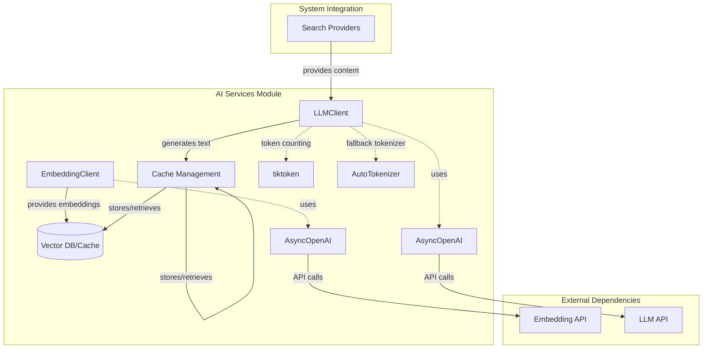
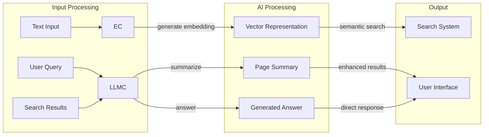
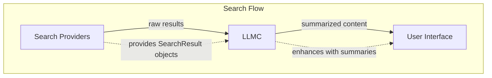
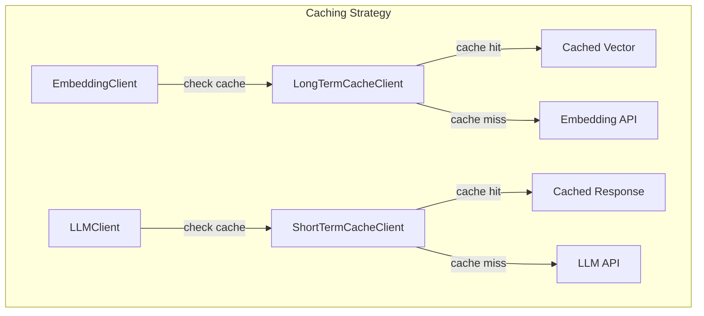
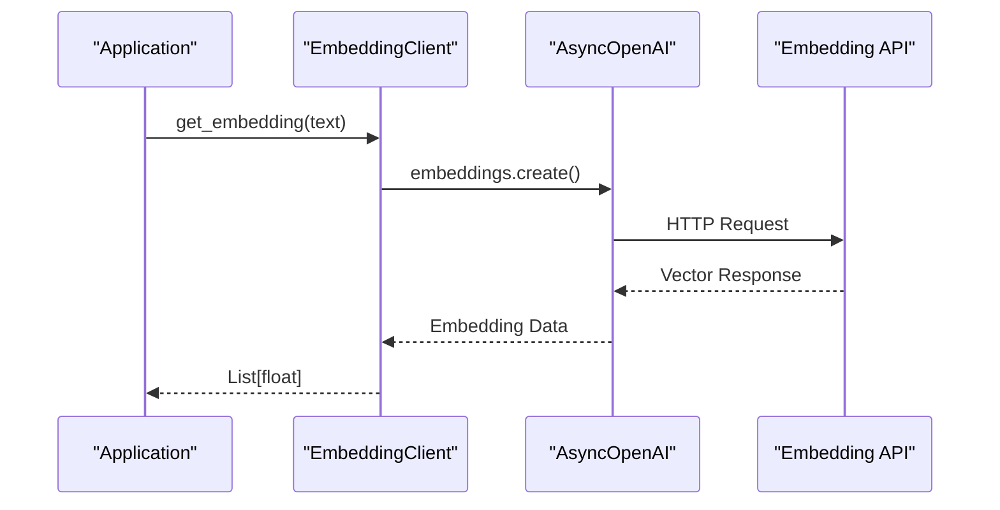
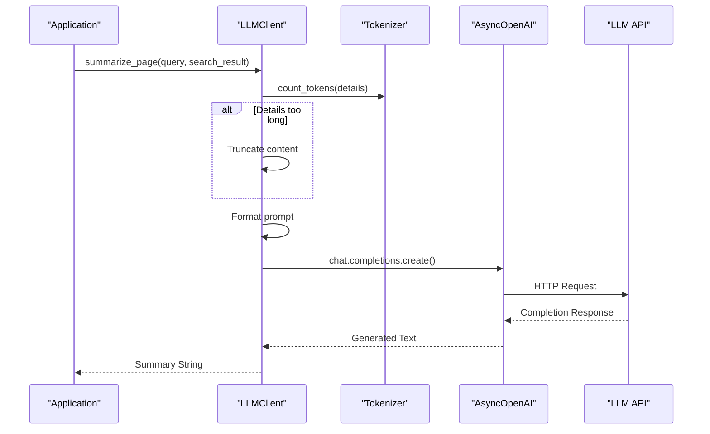

# AI Services Module Documentation

## Introduction

The AI Services module provides the core artificial intelligence capabilities for the system, handling text embeddings and language model interactions. This module serves as the primary interface to AI models, enabling semantic understanding and natural language processing functionality throughout the application.

## Module Overview

The AI Services module consists of two main components:
- **EmbeddingClient**: Handles text vectorization for semantic search and similarity operations
- **LLMClient**: Manages language model interactions for text generation, summarization, and question answering

These components work together to provide intelligent text processing capabilities that power search enhancement, content analysis, and natural language understanding features across the system.

## Architecture

### Component Architecture



### Data Flow Architecture



## Core Components

### EmbeddingClient

The `EmbeddingClient` class provides text vectorization services, converting natural language text into high-dimensional vector representations that enable semantic search and similarity comparisons.

#### Key Features
- **Asynchronous Operations**: Built on AsyncOpenAI for non-blocking API calls
- **Model Flexibility**: Configurable embedding model selection
- **Simple Interface**: Single method for text-to-vector conversion

#### Configuration
- `base_url`: API endpoint for the embedding service
- `api_key`: Authentication key for API access
- `embedding_model_name`: Specific model to use for embeddings

#### Usage Pattern
```python
# Initialize client
embedding_client = EmbeddingClient(
    base_url="https://api.example.com",
    api_key="your-api-key",
    embedding_model_name="text-embedding-3-small"
)

# Generate embedding
vector = await embedding_client.get_embedding("Your text here")
```

### LLMClient

The `LLMClient` class manages interactions with large language models, providing capabilities for text generation, summarization, and question answering based on search results.

#### Key Features
- **Multi-tokenizer Support**: Supports both tiktoken and Hugging Face tokenizers
- **Content Summarization**: Specialized method for summarizing search results
- **Token Management**: Built-in token counting and truncation capabilities
- **Prompt Engineering**: Uses structured prompts for consistent outputs

#### Configuration
- `base_url`: API endpoint for the LLM service
- `api_key`: Authentication key for API access
- `model_name`: Specific model to use for completions
- `base_model_name`: Base model for tokenizer selection
- `hf_token`: Optional Hugging Face token for tokenizer access

#### Core Methods

**Token Counting**
- Accurately counts tokens using appropriate tokenizer
- Essential for managing API limits and content truncation

**Text Completion**
- Generates text responses based on prompts
- Configurable parameters (top_p, max_tokens)
- Returns cleaned, stripped responses

**Page Summarization**
- Processes search results into concise summaries
- Handles content truncation based on token limits
- Uses structured prompts for consistent output quality

## Integration with Other Modules

### Search Providers Integration

The LLMClient works closely with search providers to enhance search results:



### Cache Management Integration

Both clients can benefit from caching mechanisms:



## Process Flows

### Text Embedding Process



### Page Summarization Process



## Configuration and Deployment

### Environment Variables

The AI Services module typically requires the following configuration:
- `EMBEDDING_API_BASE_URL`: Base URL for embedding service
- `EMBEDDING_API_KEY`: API key for embedding service
- `EMBEDDING_MODEL_NAME`: Model name for embeddings
- `LLM_API_BASE_URL`: Base URL for LLM service
- `LLM_API_KEY`: API key for LLM service
- `LLM_MODEL_NAME`: Model name for completions
- `HF_TOKEN`: Optional Hugging Face token

### Performance Considerations

**EmbeddingClient**
- Consider batching multiple texts for efficiency
- Implement caching for frequently accessed embeddings
- Monitor API rate limits and implement backoff strategies

**LLMClient**
- Token counting adds overhead; consider caching results
- Implement response caching for identical prompts
- Monitor token usage to stay within API limits
- Consider streaming responses for long completions

### Error Handling

Both clients should implement comprehensive error handling:
- API connection failures
- Authentication errors
- Rate limiting responses
- Invalid input validation
- Timeout management

## Dependencies

### External Services
- **OpenAI API**: Primary service for both embedding and LLM operations
- **Hugging Face**: Fallback tokenizer when tiktoken is unavailable

### Internal Dependencies
- **Search Providers Module**: Provides SearchResult objects for summarization
- **Cache Management Module**: Optional caching layer for performance optimization

## Best Practices

1. **Async Usage**: Always use async/await patterns for non-blocking operations
2. **Error Handling**: Implement retry logic with exponential backoff
3. **Caching**: Leverage cache management for frequently requested operations
4. **Token Management**: Always count tokens before API calls to avoid failures
5. **Content Filtering**: Implement input validation and content filtering
6. **Monitoring**: Track API usage, response times, and error rates

## Future Enhancements

Potential improvements to the AI Services module:
- Support for multiple embedding providers
- Batch processing capabilities for embeddings
- Streaming support for LLM completions
- Custom model fine-tuning integration
- Advanced prompt management and versioning
- Multi-language support enhancements

## Related Documentation

- [Search Providers](search-providers.md) - Integration with search functionality
- [Cache Management](cache-management.md) - Performance optimization strategies