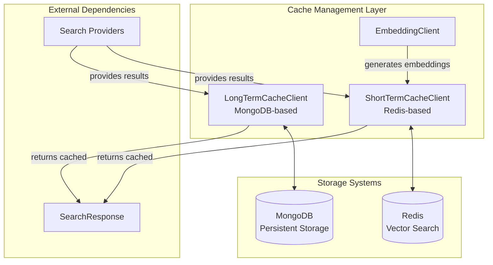
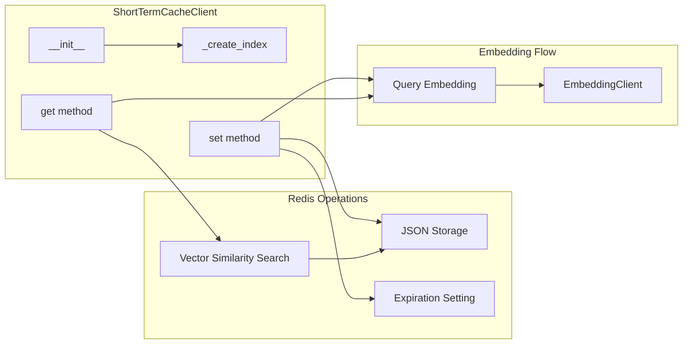
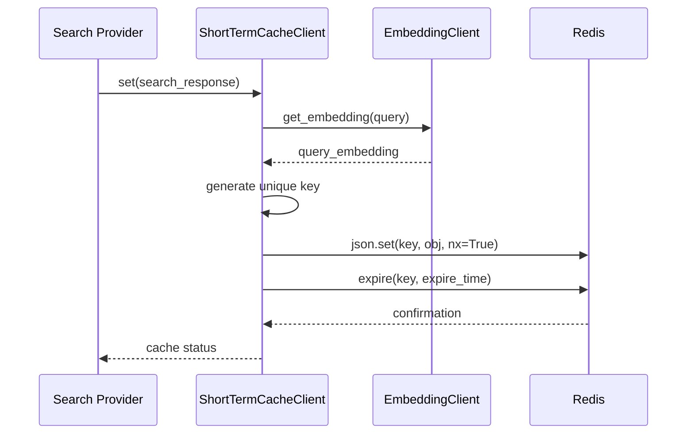
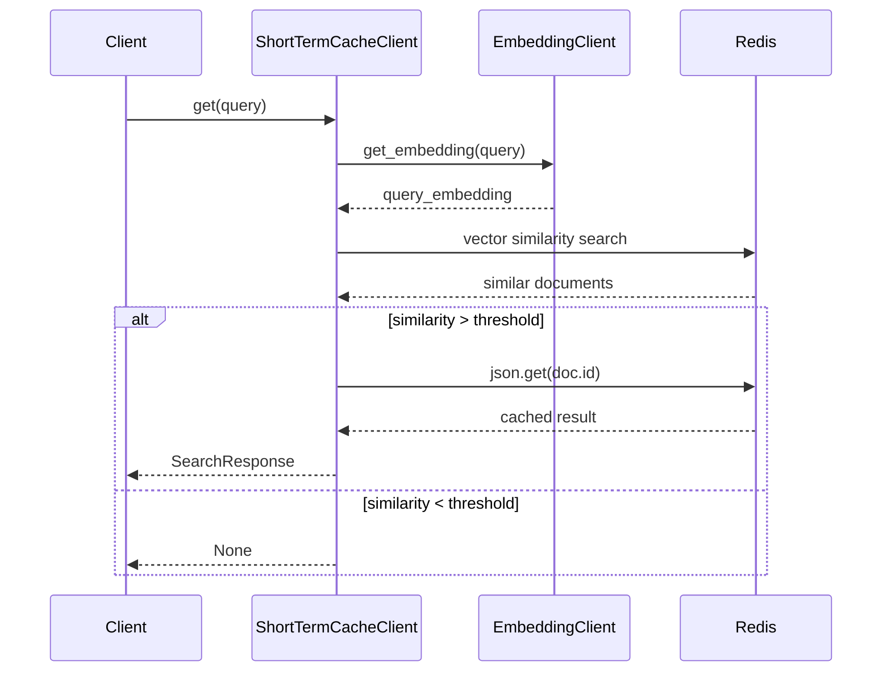
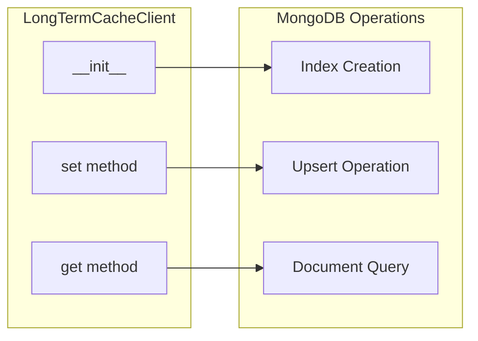
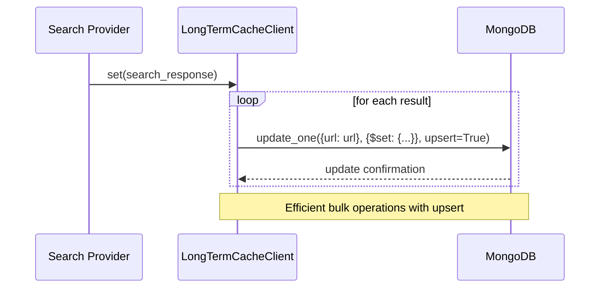
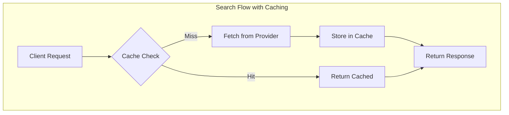
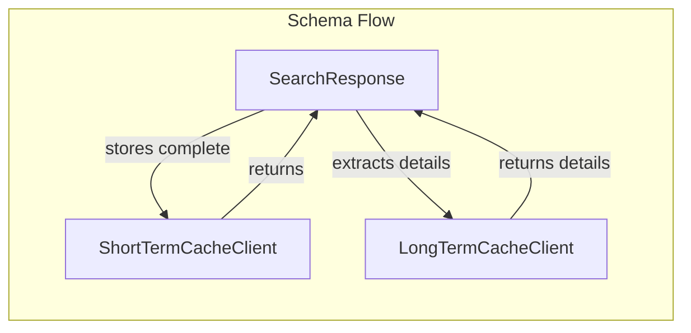
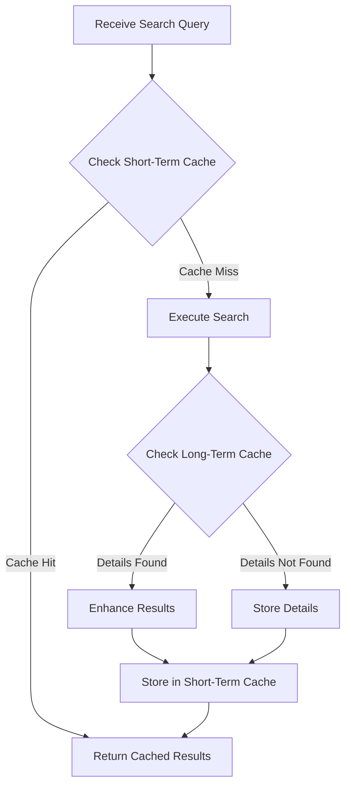

# Cache Management Module

## Introduction

The cache-management module provides a dual-layer caching system designed to optimize search operations by storing and retrieving search results efficiently. It implements both short-term and long-term caching strategies using Redis and MongoDB respectively, enabling intelligent result caching based on query similarity and URL-based content storage.

## Architecture Overview

The module implements a sophisticated caching architecture that leverages vector embeddings for intelligent cache matching and persistent storage for long-term data retention.

## Core Components

### ShortTermCacheClient

The `ShortTermCacheClient` implements an intelligent caching mechanism using Redis with vector similarity search capabilities. It stores search results with their query embeddings, enabling retrieval of cached results for semantically similar queries.

**Key Features:**
- Vector-based similarity matching using cosine distance
- Configurable similarity threshold for cache hits
- Automatic expiration management
- Redis JSON and RediSearch integration

**Architecture:**

**Cache Storage Process:**

**Cache Retrieval Process:**

### LongTermCacheClient

The `LongTermCacheClient` provides persistent caching capabilities using MongoDB for long-term storage of search result details. It focuses on URL-based caching, storing detailed information about specific URLs for extended periods.

**Key Features:**
- URL-based unique indexing
- Persistent storage in MongoDB
- Upsert operations for efficient updates
- Long-term data retention

**Architecture:**

**Data Flow:**

## Component Interactions

### Integration with Search Providers

The cache management module integrates seamlessly with the [search-providers](search-providers.md) module to provide intelligent caching capabilities:

### Data Schema Integration

Both cache clients work with the `SearchResponse` schema, ensuring consistent data handling across the system:

## Configuration and Dependencies

### External Dependencies

The module relies on several external systems and services:

1. **Redis**: Used for short-term caching with vector search capabilities
2. **MongoDB**: Used for long-term persistent storage
3. **EmbeddingClient**: Provides vector embeddings for similarity matching

### Configuration Parameters

**ShortTermCacheClient:**
- `redis_url`: Connection string for Redis instance
- `expire_time`: Cache expiration time in seconds
- `sim_threshold`: Similarity threshold for cache hits (0.0 to 1.0)
- `embedding_dim`: Dimension of vector embeddings

**LongTermCacheClient:**
- `mongo_url`: Connection string for MongoDB instance
- `db_name`: Database name for cache storage
- `collection_name`: Collection name for cache entries

## Performance Considerations

### Short-Term Cache Performance
- Vector similarity search provides O(log n) lookup time
- Redis in-memory storage ensures sub-millisecond response times
- Configurable similarity threshold balances accuracy vs. recall

### Long-Term Cache Performance
- MongoDB indexing on URL field ensures O(log n) lookup time
- Upsert operations minimize write overhead
- Persistent storage eliminates cache warmup periods

## Error Handling

The module implements comprehensive error handling:

- **Connection Failures**: Graceful handling of Redis/MongoDB connection issues
- **Index Creation**: Automatic index creation with error logging
- **Data Validation**: Schema validation for all cached objects
- **Timeout Management**: Configurable timeouts for cache operations

## Usage Patterns

### Typical Integration Pattern

## Monitoring and Observability

The module provides comprehensive logging for:
- Cache hit/miss rates
- Similarity scores for vector searches
- Connection status for external systems
- Performance metrics for cache operations

## Security Considerations

- Connection strings should be properly secured
- Redis and MongoDB instances should implement appropriate access controls
- Data encryption should be considered for sensitive cached content
- Regular cleanup of expired cache entries

## Future Enhancements

Potential improvements to the cache management system:

1. **Distributed Caching**: Support for Redis cluster deployments
2. **Cache Warming**: Proactive population of frequently accessed content
3. **Intelligent Eviction**: LRU/LFU-based cache eviction policies
4. **Compression**: Data compression for large cache entries
5. **Metrics Export**: Integration with monitoring systems like Prometheus