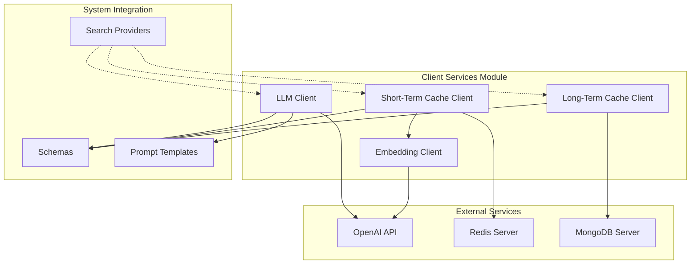
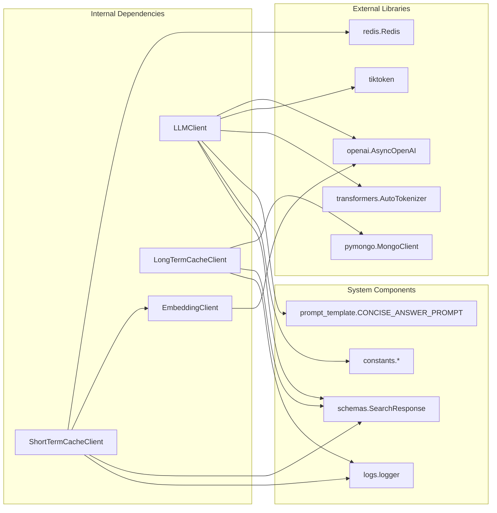
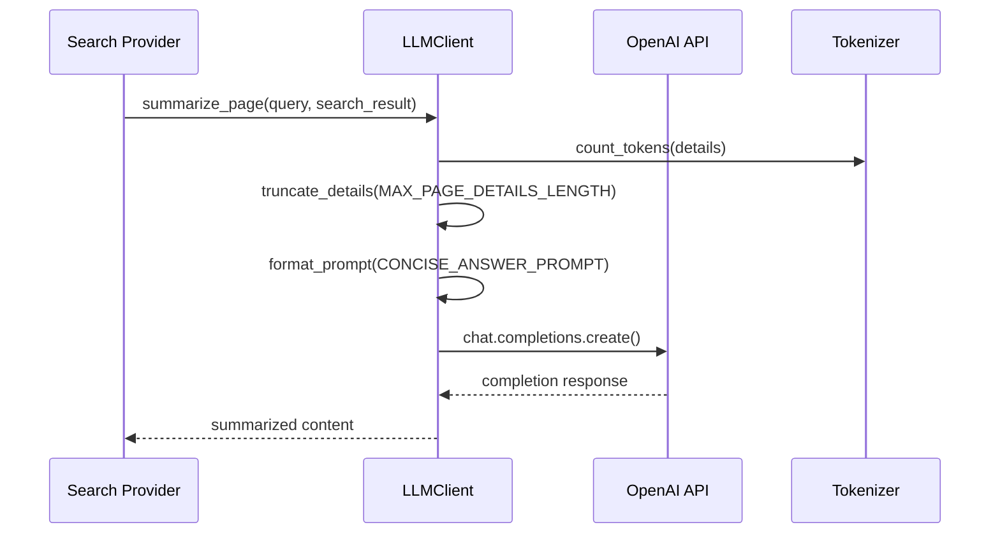
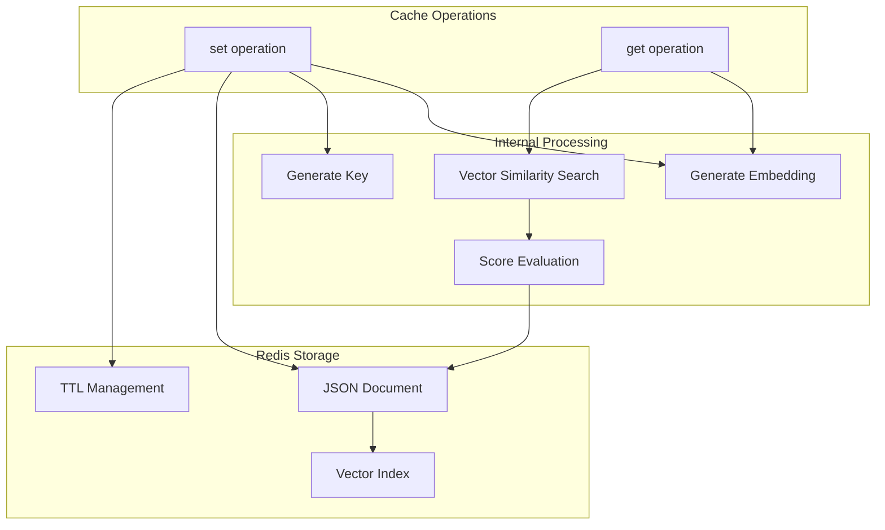
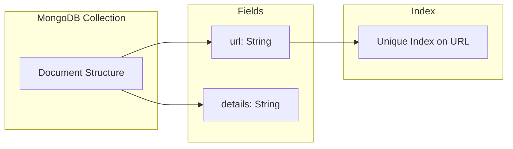
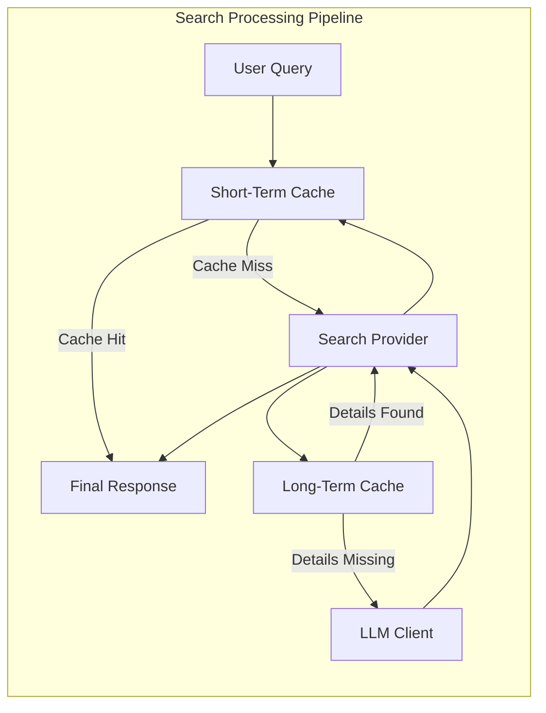

# Client Services Module Documentation

## Introduction

The client-services module provides the foundational client infrastructure for the search system, managing interactions with external services and data storage systems. This module implements a layered client architecture that handles LLM operations, embedding generation, and multi-tier caching strategies to optimize search performance and reliability.

The module serves as the primary interface between the search system and external AI services (OpenAI-compatible APIs), while providing intelligent caching mechanisms to reduce API calls and improve response times. It implements both short-term vector similarity caching using Redis and long-term persistent storage using MongoDB.

## Architecture Overview

The client-services module follows a client-based architecture pattern where each client specializes in a specific type of external interaction. The module is organized into three main client categories:

### Core Architecture



### Component Dependencies



## Component Details

### LLM Client (LLMClient)

The LLM Client serves as the primary interface for interacting with Large Language Models through OpenAI-compatible APIs. It provides token counting, text completion, and content summarization capabilities specifically tailored for search result processing.

#### Key Features:
- **Dual Tokenizer Support**: Automatically selects between tiktoken (for OpenAI models) and Hugging Face tokenizers
- **Async Operations**: Fully asynchronous implementation for non-blocking I/O
- **Content Summarization**: Specialized method for summarizing search results with configurable token limits
- **Token Management**: Enforces maximum token limits per page to control API costs

#### Configuration Parameters:
- `base_url`: OpenAI-compatible API endpoint
- `api_key`: Authentication key for the API service
- `model_name`: Specific model identifier for completions
- `base_model_name`: Base model name for tokenizer selection
- `hf_token`: Optional Hugging Face token for tokenizer access

#### Usage Flow:


### Embedding Client (EmbeddingClient)

The Embedding Client provides a simple, focused interface for generating vector embeddings from text content. It serves as the foundation for vector similarity operations in the caching layer.

#### Key Features:
- **Single Responsibility**: Dedicated to embedding generation only
- **Async Operations**: Non-blocking embedding requests
- **Standardized Output**: Consistent vector format for all embedding operations

#### Configuration Parameters:
- `base_url`: OpenAI-compatible API endpoint
- `api_key`: Authentication key for the API service
- `embedding_model_name`: Specific embedding model identifier

### Short-Term Cache Client (ShortTermCacheClient)

The Short-Term Cache Client implements an intelligent vector similarity caching system using Redis as the backend storage. It provides semantic caching capabilities based on query similarity rather than exact string matching.

#### Key Features:
- **Vector Similarity Search**: Uses Redis RediSearch for semantic similarity matching
- **Configurable Threshold**: Adjustable similarity threshold for cache hits
- **Automatic Expiration**: Time-based cache invalidation
- **JSON Storage**: Stores complete search responses as JSON documents
- **Embedding Integration**: Automatically generates embeddings for cache operations

#### Cache Architecture:


#### Configuration Parameters:
- `redis_url`: Redis connection string
- `expire_time`: Cache expiration time in seconds
- `sim_threshold`: Similarity threshold for cache hits (0.0 to 1.0)
- `embedding_client`: EmbeddingClient instance for vector generation
- `embedding_dim`: Dimension of embedding vectors

### Long-Term Cache Client (LongTermCacheClient)

The Long-Term Cache Client provides persistent storage for detailed page content using MongoDB. It focuses on caching URL-specific details that remain stable over time.

#### Key Features:
- **Persistent Storage**: MongoDB-based long-term caching
- **URL-Based Indexing**: Unique index on URLs for fast retrieval
- **Upsert Operations**: Automatic insert or update behavior
- **Selective Caching**: Only caches detailed content, not entire search responses

#### Storage Schema:


#### Configuration Parameters:
- `mongo_url`: MongoDB connection string
- `db_name`: Database name for cache storage
- `collection_name`: Collection name for cache entries

## Data Flow Architecture

### Search Result Processing Flow



### Caching Strategy

The module implements a two-tier caching strategy:

1. **Short-Term Cache (Redis)**:
   - Caches complete search responses
   - Uses vector similarity for semantic matching
   - Configurable expiration times
   - Suitable for frequently asked similar queries

2. **Long-Term Cache (MongoDB)**:
   - Caches detailed page content by URL
   - Persistent storage with no expiration
   - Complements short-term cache for stable content
   - Reduces need for web scraping or API calls

## Integration with Search Providers

The client-services module integrates with [search-providers](search-providers.md) to provide a complete search solution:

### Integration Points:
- **LLM Client**: Used by search providers for content summarization and answer generation
- **Short-Term Cache**: Provides semantic caching for search queries and results
- **Long-Term Cache**: Stores detailed page content for reuse across searches
- **Embedding Client**: Powers the vector similarity search in the short-term cache

### Benefits:
- **Reduced API Costs**: Caching minimizes repeated LLM API calls
- **Improved Performance**: Cached results provide instant responses
- **Enhanced Relevance**: Vector similarity enables semantic query matching
- **Scalability**: Async clients handle high concurrent loads

## Configuration and Deployment

### Environment Variables

The module components typically require the following configuration:

```bash
# LLM Client Configuration
LLM_BASE_URL=https://api.openai.com/v1
LLM_API_KEY=your_api_key
LLM_MODEL_NAME=gpt-3.5-turbo
LLM_BASE_MODEL_NAME=gpt-3.5-turbo

# Embedding Client Configuration
EMBEDDING_BASE_URL=https://api.openai.com/v1
EMBEDDING_API_KEY=your_api_key
EMBEDDING_MODEL_NAME=text-embedding-ada-002

# Cache Configuration
REDIS_URL=redis://localhost:6379
CACHE_EXPIRE_TIME=3600
SIMILARITY_THRESHOLD=0.85
EMBEDDING_DIMENSION=1536

MONGO_URL=mongodb://localhost:27017
MONGO_DB_NAME=search_cache
MONGO_COLLECTION_NAME=page_details
```

### Performance Considerations

- **Redis Memory**: Monitor Redis memory usage as vector indexes can be memory-intensive
- **MongoDB Storage**: Regular cleanup may be needed for long-term cache growth
- **API Rate Limits**: Implement rate limiting for OpenAI API calls
- **Embedding Generation**: Batch embedding requests when possible for efficiency

## Error Handling and Logging

The module implements comprehensive error handling:

- **Connection Failures**: Graceful handling of Redis and MongoDB connection issues
- **API Errors**: Proper error propagation from OpenAI API calls
- **Token Limits**: Enforcement of token limits to prevent API errors
- **Validation**: Input validation for all client operations

Logging is integrated throughout the module to provide visibility into:
- Cache hit/miss rates
- API call patterns
- Error conditions and recovery
- Performance metrics

## Future Enhancements

Potential improvements to the client-services module include:

- **Multi-Provider Support**: Extend LLM client to support multiple AI providers
- **Advanced Caching**: Implement cache warming and preloading strategies
- **Metrics Collection**: Add comprehensive performance and usage metrics
- **Circuit Breakers**: Implement circuit breaker patterns for external services
- **Cache Analytics**: Add detailed analytics for cache performance optimization