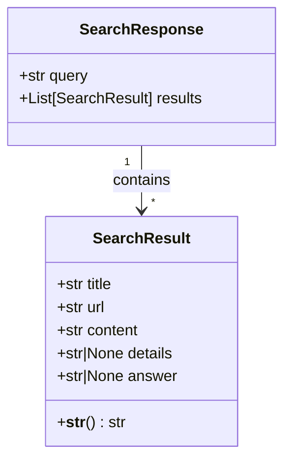
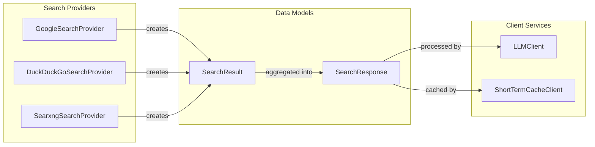

# Data Models Module Documentation

## Introduction

The data-models module serves as the foundational schema layer for the search system, providing standardized data structures that facilitate consistent data exchange between different components. This module defines the core data models used throughout the system for representing search results and responses, ensuring type safety and data integrity across the application.

## Architecture Overview

The data-models module implements a clean, Pydantic-based schema system that provides:

- **Type Safety**: Leverages Python's type hints and Pydantic's validation to ensure data consistency
- **Serialization Support**: Built-in JSON serialization/deserialization capabilities
- **Validation**: Automatic data validation and error handling
- **Documentation**: Self-documenting models with field descriptions

### Core Components



## Component Details

### SearchResult

The `SearchResult` class represents individual search results returned by various search providers. It encapsulates all essential information about a search result item.

**Attributes:**
- `title` (str): The title of the search result
- `url` (str): The URL/link to the source content
- `content` (str): A summary or snippet of the content
- `details` (Optional[str]): Additional detailed information (optional)
- `answer` (Optional[str]): Direct answer extracted from the content (optional)

**Key Features:**
- Provides a human-readable string representation via `__str__()` method
- Optional fields allow for flexible data representation based on search provider capabilities
- Immutable design through Pydantic's BaseModel ensures data integrity

### SearchResponse

The `SearchResponse` class aggregates multiple search results for a given query, providing a unified response format regardless of the underlying search provider.

**Attributes:**
- `query` (str): The original search query string
- `results` (List[SearchResult]): Collection of search results (defaults to empty list)

**Key Features:**
- Uses Pydantic's Field with default_factory for safe list initialization
- Provides a consistent response structure across all search providers
- Enables easy serialization for API responses or caching

## Data Flow Integration



## System Integration

The data-models module serves as the common language between different system components:

### Search Provider Integration
All search providers ([search-providers.md](search-providers.md)) use these models to standardize their output format:
- Each provider implementation creates `SearchResult` instances from their specific API responses
- `SearchResponse` objects are returned to ensure consistent interface across providers

### Client Service Integration
Client services ([client-services.md](client-services.md)) consume these models for further processing:
- **LLMClient** processes `SearchResponse` objects to generate contextual responses
- **Cache Clients** serialize and store `SearchResponse` objects for efficient retrieval

## Usage Patterns

### Creating Search Results

```python
# Individual search result
result = SearchResult(
    title="Example Article",
    url="https://example.com/article",
    content="This is a summary of the article content...",
    details="Additional metadata or extended content",
    answer="Direct answer to a question if available"
)

# Complete search response
response = SearchResponse(
    query="machine learning basics",
    results=[result1, result2, result3]
)
```

### Serialization and Validation

```python
# JSON serialization
json_data = response.model_dump_json()

# Parse from JSON
parsed_response = SearchResponse.model_validate_json(json_data)

# Validation happens automatically
invalid_result = SearchResult(title="Valid", url="invalid-url", content="Content")
# Pydantic will validate URL format and raise ValidationError if invalid
```

## Design Principles

### 1. Provider Agnostic
The models are designed to work with any search provider, ensuring that the system can easily integrate new search sources without modifying the core data structures.

### 2. Extensibility
Optional fields (`details`, `answer`) allow providers to include additional information without breaking compatibility with consumers that don't use these fields.

### 3. Performance Optimized
- Lightweight Pydantic models with minimal overhead
- Efficient serialization for caching and network transmission
- Default factory pattern prevents mutable default arguments issue

### 4. Developer Friendly
- Clear field names and structure
- Built-in string representation for debugging
- Type hints provide excellent IDE support

## Error Handling

The Pydantic-based design provides robust error handling:

- **Type Validation**: Ensures all fields match their declared types
- **Required Field Validation**: Prevents creation of incomplete models
- **Custom Validators**: Can be added for business logic validation
- **Detailed Error Messages**: Provides clear feedback on validation failures

## Future Considerations

### Potential Enhancements
1. **Ranking Information**: Add score/ranking fields for result ordering
2. **Timestamps**: Include discovery/creation timestamps for cache management
3. **Source Metadata**: Add fields for source reliability, category, or type
4. **Multilingual Support**: Consider internationalization for content fields

### Scaling Considerations
- Models are designed to remain lightweight even with large result sets
- Pagination support can be added to `SearchResponse` if needed
- Consider adding compression hints for large content fields

## Related Documentation

- [Search Providers Module](search-providers.md) - Learn how search providers use these data models
- [Client Services Module](client-services.md) - Understand how client services consume search responses

## Dependencies

- **pydantic**: Core dependency for data validation and serialization
- **typing**: Python's typing module for type hints

The module has no internal dependencies on other system modules, making it a stable foundation that other modules can safely depend upon.