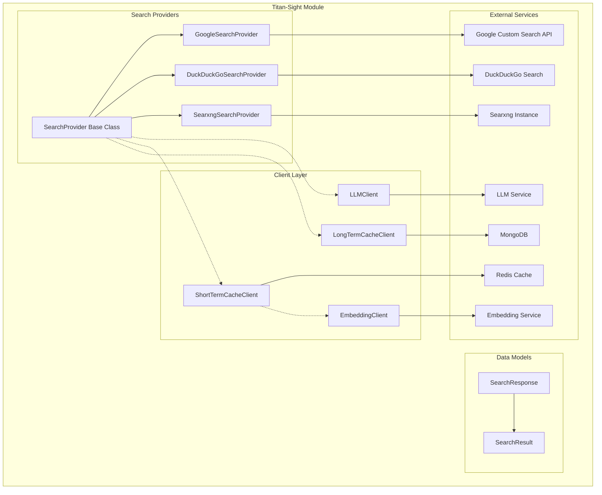
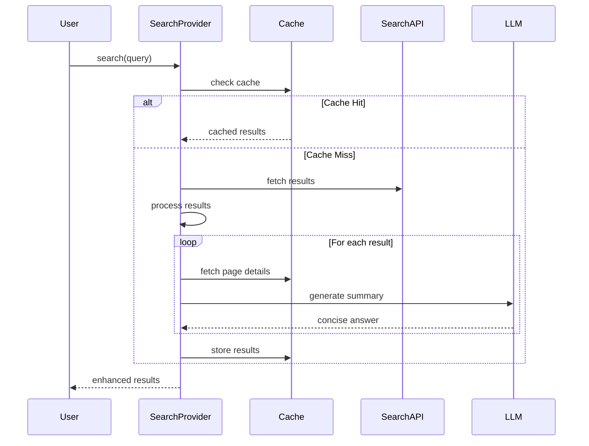

# Titan-Sight Module Documentation

## Overview

Titan-Sight is a comprehensive search aggregation and intelligent content processing module that provides unified access to multiple search providers while enhancing search results with AI-powered content analysis and caching capabilities. The module serves as the primary search infrastructure for the Titan ecosystem, offering intelligent search result processing, content summarization, and multi-tier caching for optimal performance.

## Architecture

## Core Functionality

### 1. Multi-Provider Search Aggregation
The module implements a provider pattern that allows seamless integration with multiple search engines:
- **Google Custom Search API** - Provides access to Google's search infrastructure
- **DuckDuckGo Search** - Privacy-focused search integration
- **Searxng** - Self-hosted metasearch engine support

### 2. Intelligent Content Processing
Each search result undergoes intelligent processing:
- **Content Fetching** - Retrieves full page content using trafilatura
- **AI-Powered Summarization** - Generates concise answers using LLM
- **Content Caching** - Multi-tier caching system for performance optimization

### 3. Advanced Caching System
Implements a sophisticated two-tier caching mechanism:
- **Short-term Cache** - Redis-based vector similarity search for query caching
- **Long-term Cache** - MongoDB storage for detailed page content

## Sub-Modules

### Search Providers
The search provider subsystem implements a unified interface for multiple search engines. Each provider handles the specific API requirements and response formats of its respective search service.

**Documentation**: [search-providers.md](search-providers.md)

### Client Services
The client layer provides specialized services for AI processing and data storage:
- **LLM Client** - Handles AI-powered content summarization
- **Embedding Client** - Manages vector embeddings for similarity search
- **Cache Clients** - Implement short-term and long-term caching strategies

**Documentation**: [client-services.md](client-services.md)

### Data Models
Standardized data structures for search results and responses, ensuring consistent data flow across the module.

**Documentation**: [data-models.md](data-models.md)

## Key Features

### 1. Unified Search Interface
All search providers implement the common `SearchProvider` base class, ensuring consistent behavior and easy extensibility for new search engines.

### 2. Intelligent Result Enhancement
Search results are automatically enhanced with:
- Full page content extraction
- AI-generated concise summaries
- Relevance scoring and filtering

### 3. Performance Optimization
- **Asynchronous Processing** - All operations are async for optimal performance
- **Multi-tier Caching** - Reduces API calls and improves response times
- **Timeout Management** - Configurable timeouts prevent hanging operations

### 4. Scalability
- **Provider Abstraction** - Easy to add new search providers
- **Configurable Parameters** - Flexible timeout and result limits
- **Vector-based Caching** - Efficient similarity search for query caching

## Data Flow

## Integration Points

### External Dependencies
- **Search APIs** - Google Custom Search, DuckDuckGo, Searxng
- **AI Services** - OpenAI-compatible LLM and embedding services
- **Storage Systems** - Redis for caching, MongoDB for long-term storage

### Internal Dependencies
- **Trafilatura** - Content extraction from web pages
- **Pydantic** - Data validation and serialization
- **AsyncIO** - Asynchronous processing framework

## Configuration

The module supports extensive configuration for:
- Search provider credentials and endpoints
- LLM service parameters and models
- Cache expiration times and similarity thresholds
- Timeout values for various operations
- Result limits and processing parameters

## Error Handling

Comprehensive error handling ensures system stability:
- **Timeout Management** - Prevents operations from hanging
- **Graceful Degradation** - Continues operation even if some providers fail
- **Logging** - Detailed logging for debugging and monitoring
- **Fallback Mechanisms** - Alternative approaches when primary methods fail