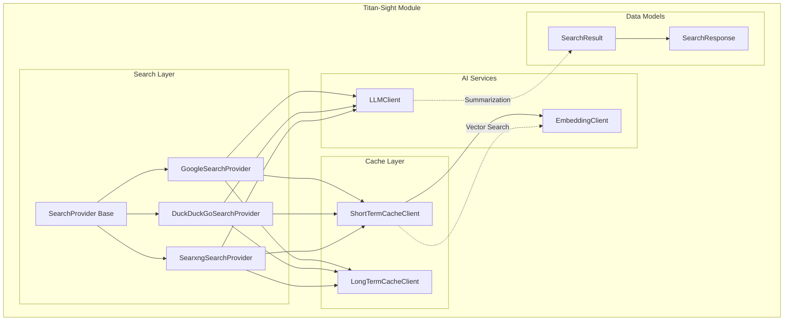
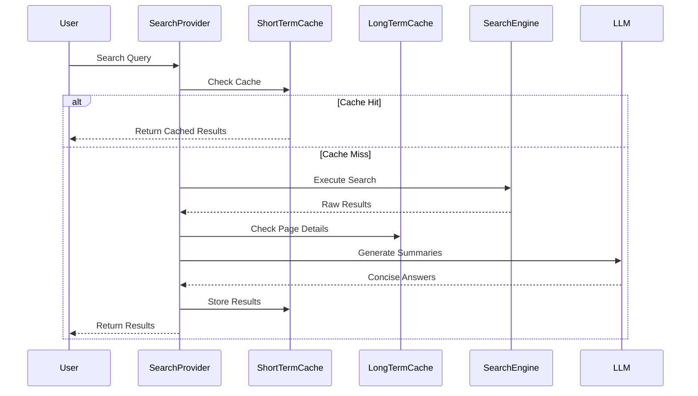

# Titan-Sight Module Documentation

## Overview

Titan-Sight is a sophisticated search aggregation and intelligence module that provides unified access to multiple search providers while implementing intelligent caching mechanisms and AI-powered content summarization. The module is designed to deliver comprehensive search results with detailed page content and concise AI-generated answers.

## Purpose

The primary purpose of Titan-Sight is to:
- Aggregate search results from multiple providers (Google, DuckDuckGo, SearXNG)
- Implement intelligent caching strategies for performance optimization
- Extract and summarize detailed page content using AI
- Provide vector similarity search for query matching
- Generate concise answers from page content using LLM models

## Architecture

## Core Components

### 1. Search Providers (`src.search.providers`)
The search layer implements a provider pattern with pluggable search engines:

- **Base Provider**: Abstract `SearchProvider` class defining the contract for all search implementations
- **Google Search Provider**: Integration with Google Custom Search API
- **DuckDuckGo Provider**: Integration with DuckDuckGo search
- **SearXNG Provider**: Integration with self-hosted SearXNG instances

Each provider handles search queries, result formatting, and integrates with caching and AI services.

### 2. Cache Layer (`src.clients.cache_clients`)
Implements a two-tier caching strategy:

- **Short-Term Cache**: Redis-based vector similarity cache for query results
- **Long-Term Cache**: MongoDB-based persistent storage for page details

The caching system significantly improves performance by storing search results and extracted page content.

### 3. AI Services (`src.clients`)
Provides AI-powered capabilities:

- **Embedding Client**: Generates vector embeddings for semantic search
- **LLM Client**: Summarizes page content and generates concise answers

### 4. Data Models (`src.schemas`)
Defines the data structures:

- **SearchResult**: Individual search result with title, URL, content, and optional details/answer
- **SearchResponse**: Container for search query and results list

## Key Features

### Intelligent Caching
- **Vector Similarity Search**: Uses embeddings to find similar queries in cache
- **Configurable Expiration**: Short-term cache with TTL, long-term persistent storage
- **Dual Cache Strategy**: Combines fast vector search with durable document storage

### AI-Powered Content Processing
- **Page Content Extraction**: Uses trafilatura for reliable web content extraction
- **Content Summarization**: LLM-powered generation of concise answers
- **Token-Aware Processing**: Respects token limits for optimal LLM usage

### Multi-Provider Search
- **Unified Interface**: Consistent API across different search providers
- **Provider-Specific Features**: Leverages unique capabilities of each provider
- **Configurable Result Limits**: Flexible control over result quantity

## Data Flow

## Sub-Modules

The Titan-Sight module is organized into several sub-modules, each with detailed documentation:

### [Search Providers](search-providers.md)
Detailed documentation for the search provider implementations, including configuration options and provider-specific features.

### [Cache Management](cache-management.md)
Comprehensive guide to the caching system, including Redis vector search implementation and MongoDB integration.

### [AI Services](ai-services.md)
Documentation for embedding generation and LLM integration, including model configuration and prompt engineering.

## Data Models

### [SearchResult and SearchResponse](schemas.md)
Core data structures that define the search result format and response containers used throughout the module.

## Integration Points

Titan-Sight integrates with external services:

- **Redis**: For short-term vector similarity caching
- **MongoDB**: For long-term persistent storage
- **OpenAI API**: For embeddings and LLM completions
- **Search APIs**: Google Custom Search, DuckDuckGo, SearXNG

## Configuration

The module requires configuration for:
- Redis connection settings
- MongoDB connection parameters
- API keys for search providers and AI services
- Cache expiration times and similarity thresholds
- LLM model selection and parameters

## Performance Considerations

- **Async Operations**: All I/O operations are asynchronous for optimal performance
- **Timeout Management**: Configurable timeouts for web fetching and AI processing
- **Concurrent Processing**: Parallel processing of multiple search results
- **Vector Search**: Efficient similarity matching using Redis vector fields

## Error Handling

The module implements comprehensive error handling:
- Graceful degradation when providers are unavailable
- Timeout protection for external service calls
- Fallback mechanisms for cache failures
- Detailed logging for debugging and monitoring