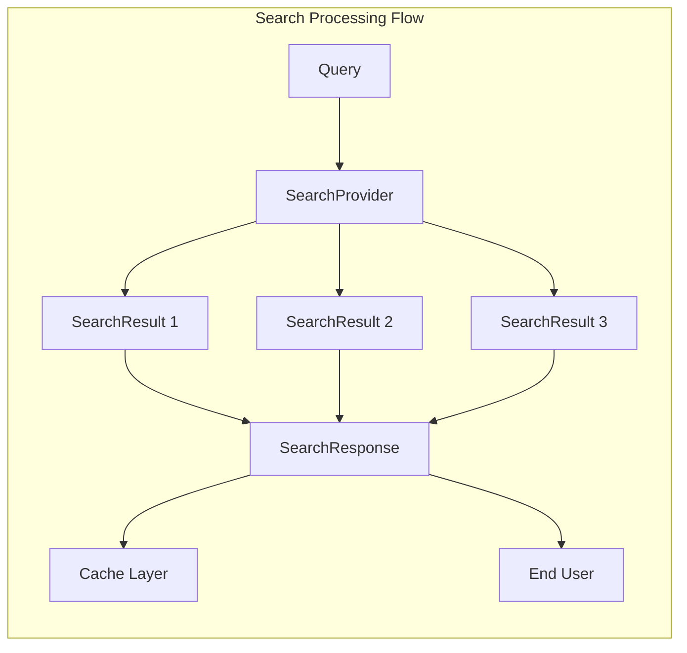

# Data Models - Schemas Documentation

## Overview

The schemas module defines the core data structures used throughout the Titan-Sight system. These Pydantic models provide type safety, validation, and serialization capabilities for search results and responses.

## Core Components

### SearchResult

The `SearchResult` model represents an individual search result with the following attributes:

```python
class SearchResult(BaseModel):
    title: str              # The title of the search result
    url: str                # The URL of the result
    content: str            # Brief summary or snippet
    details: Optional[str] = None    # Full page content (optional)
    answer: Optional[str] = None     # AI-generated concise answer (optional)
```

#### Purpose
- Encapsulates all information about a single search result
- Provides optional fields for enhanced content and AI-generated summaries
- Supports the complete data flow from raw search to processed result

#### Usage
- Created by search providers when processing raw search API responses
- Enhanced with detailed content through web scraping
- Augmented with AI-generated answers through LLM processing

#### String Representation
The model includes a custom `__str__` method for readable output:
```
Title: {title}
URL: {url}
Summary: {content}
```

### SearchResponse

The `SearchResponse` model represents a complete search response:

```python
class SearchResponse(BaseModel):
    query: str                              # The original search query
    results: List[SearchResult] = Field(default_factory=list)
```

#### Purpose
- Container for search query and all associated results
- Provides a unified response format across all search providers
- Supports caching and serialization for the caching layer

#### Features
- **Query Tracking**: Maintains the original search query for context
- **Result Collection**: Contains a list of `SearchResult` objects
- **Default Factory**: Uses Pydantic's `Field(default_factory=list)` for safe initialization
- **Model Dumping**: Supports serialization for caching via `model_dump()` method

## Data Flow Integration



## Validation and Type Safety

Both models leverage Pydantic's validation system:

- **Automatic Validation**: Ensures data integrity when creating instances
- **Type Coercion**: Converts compatible types when possible
- **Error Reporting**: Provides detailed validation error messages
- **IDE Support**: Full type hint support for development tools

## Serialization Support

The models support various serialization formats:

- **JSON**: Primary format for API responses and caching
- **Python Dict**: Via `model_dump()` for internal processing
- **Redis JSON**: Direct serialization for Redis cache storage

## Usage Examples

### Creating a SearchResponse
```python
# Create individual results
result1 = SearchResult(
    title="Example Page",
    url="https://example.com",
    content="This is an example page summary"
)

# Create response with results
response = SearchResponse(
    query="example search",
    results=[result1]
)
```

### Enhancing Results with AI Content
```python
# Add detailed content and AI-generated answer
result.details = "Full page content extracted from the website..."
result.answer = "This page provides a comprehensive example of..."
```

## Integration with Other Modules

### Search Providers
- All providers return `SearchResponse` objects for consistency
- Providers create `SearchResult` instances from their specific API formats

### Cache Layer
- `SearchResponse` objects are serialized for storage in both Redis and MongoDB
- Vector embeddings are generated from the query field for similarity search

### AI Services
- LLM clients process `SearchResult` objects to generate concise answers
- Embedding clients use the query field for vector generation

## Design Principles

1. **Simplicity**: Minimal, focused models that capture essential data
2. **Extensibility**: Optional fields allow for enhanced functionality
3. **Consistency**: Unified format across all search providers
4. **Performance**: Lightweight models suitable for caching and serialization
5. **Type Safety**: Full type annotations for better development experience

## Future Considerations

The schema design allows for future enhancements:
- Additional metadata fields (timestamp, source reliability, etc.)
- Support for different content types (images, videos, etc.)
- Enhanced ranking and relevance scoring
- Multi-language support considerations