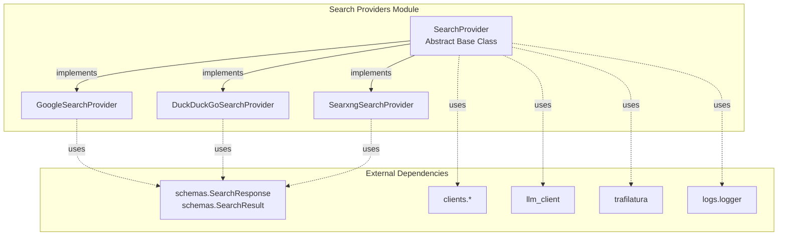
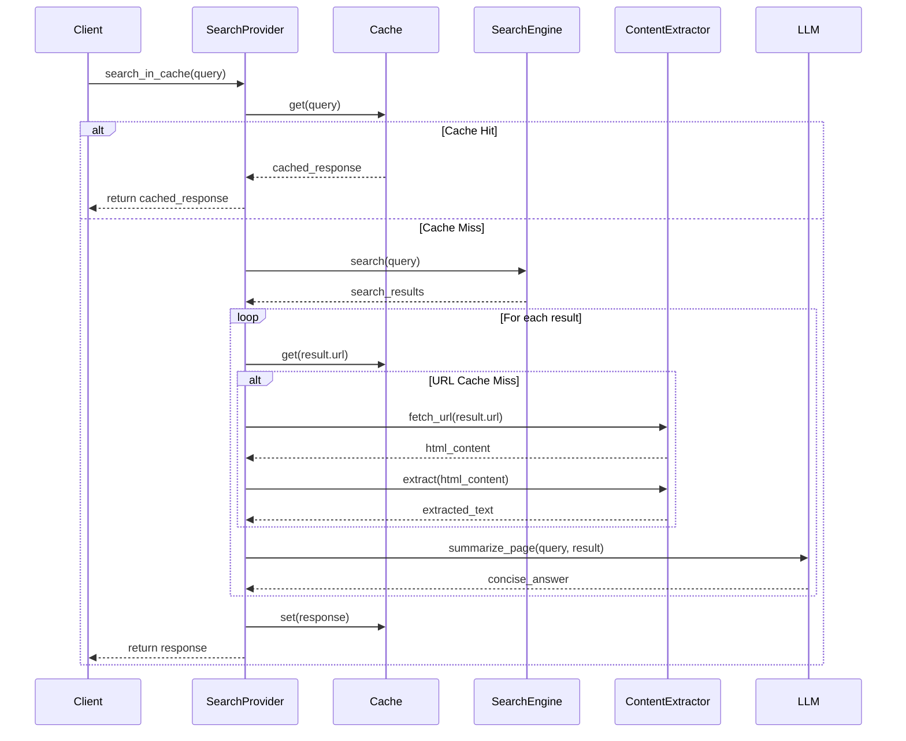
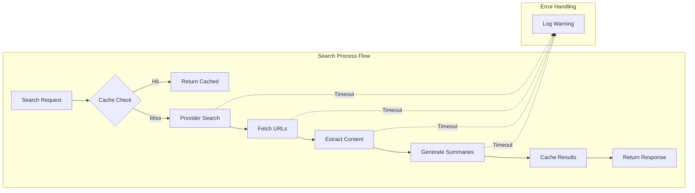
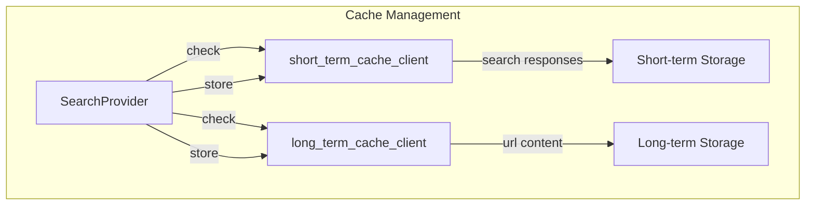

# Search Providers Module

## Introduction

The search-providers module implements a pluggable architecture for web search functionality, providing a unified interface to multiple search engines including Google Custom Search, DuckDuckGo, and SearXNG. This module serves as the primary search interface for the application, offering intelligent caching, content extraction, and AI-powered summarization capabilities.

## Architecture Overview

The module follows a strategy pattern design with a common base class that defines the search interface and concrete implementations for each search provider. This architecture allows for easy addition of new search engines while maintaining consistent behavior across all providers.



## Core Components

### SearchProvider (Abstract Base Class)

The `SearchProvider` abstract base class defines the contract that all search providers must implement. It provides both the core search interface and common functionality for caching and content processing.

**Key Responsibilities:**
- Define the abstract `search()` method that all providers must implement
- Implement caching mechanisms (short-term and long-term)
- Handle content extraction and AI-powered summarization
- Manage timeouts and error handling for web requests

**Key Methods:**
- `search(query, max_num_result)`: Abstract method for performing searches
- `search_in_cache(query, max_num_result, newest_first, sumup_page_timeout)`: Cached search with intelligent cache management
- `fetch_details_and_generate_consise_answer(query, results, timeout)`: Fetches detailed content and generates AI summaries

### GoogleSearchProvider

Implements search functionality using Google Custom Search JSON API. Requires API key and search engine ID for authentication.

**Features:**
- Supports date-based sorting for newest results first
- Configurable number of results
- Integration with Google's Custom Search API

**Configuration:**
- `api_key`: Google Custom Search API key
- `search_engine_id`: Custom search engine identifier

### DuckDuckGoSearchProvider

Provides search capabilities using DuckDuckGo's search engine through the `duckduckgo_search` library.

**Features:**
- Privacy-focused search without API keys
- Simple configuration
- Direct integration with DuckDuckGo search results

### SearxngSearchProvider

Implements search functionality using a self-hosted SearXNG instance, providing a privacy-respecting metasearch engine.

**Features:**
- Self-hosted search solution
- Support for both text and image searches
- Configurable host endpoint

**Configuration:**
- `host`: SearXNG instance URL

## Data Flow Architecture



## Component Interactions



## Caching Strategy

The module implements a two-tier caching system:

1. **Short-term Cache**: Stores complete search responses for quick retrieval
2. **Long-term Cache**: Stores individual URL content for reuse across searches



## Content Processing Pipeline

The module includes sophisticated content extraction and summarization capabilities:

1. **URL Fetching**: Uses `trafilatura` for reliable web content extraction
2. **Content Extraction**: Intelligent text extraction from HTML
3. **AI Summarization**: Leverages LLM to generate concise answers relevant to the search query
4. **Timeout Management**: Configurable timeouts for each processing step

## Dependencies

The search-providers module integrates with several other system components:

- **[schemas](schemas.md)**: Defines `SearchResponse` and `SearchResult` data structures
- **[clients](clients.md)**: Provides cache clients and LLM client for content processing
- **[constants](constants.md)**: Contains configuration for content extraction
- **[logs](logs.md)**: Provides logging functionality

## Usage Patterns

### Basic Search
```python
# Initialize provider
provider = GoogleSearchProvider(api_key="key", search_engine_id="id")

# Perform search
response = await provider.search("query", max_results=10)
```

### Cached Search
```python
# Use caching for better performance
response = await provider.search_in_cache(
    query="query", 
    max_num_result=10,
    newest_first=True,
    sumup_page_timeout=30
)
```

## Performance Considerations

- **Caching**: Significantly reduces response time for repeated queries
- **Async Processing**: All operations are asynchronous for better concurrency
- **Timeout Management**: Prevents hanging on slow or unresponsive URLs
- **Error Resilience**: Continues processing even if individual results fail

## Error Handling

The module implements comprehensive error handling:
- Network timeouts for URL fetching and content extraction
- Graceful degradation when individual results fail
- Detailed logging for debugging and monitoring
- Exception handling in async operations using `return_exceptions=True`

## Extension Points

New search providers can be easily added by:
1. Extending the `SearchProvider` base class
2. Implementing the `search()` method
3. Optionally overriding caching behavior
4. Adding configuration parameters in the constructor

This modular design ensures that the search functionality can be easily extended with new providers while maintaining consistent behavior and interface across all implementations.