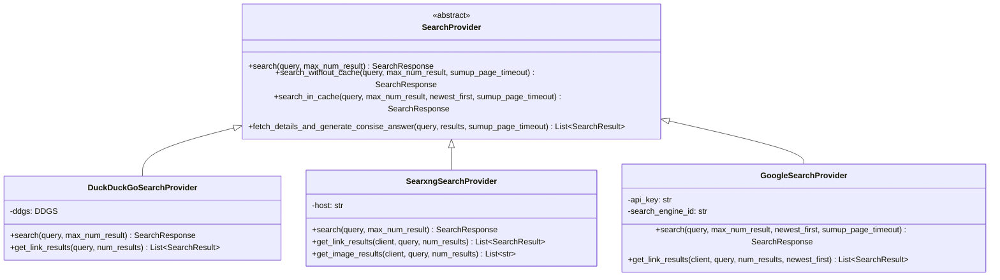
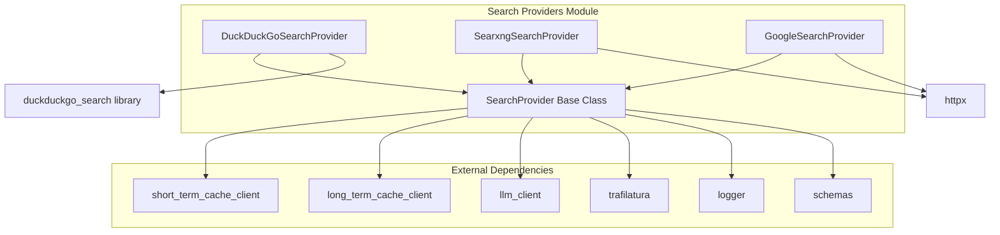
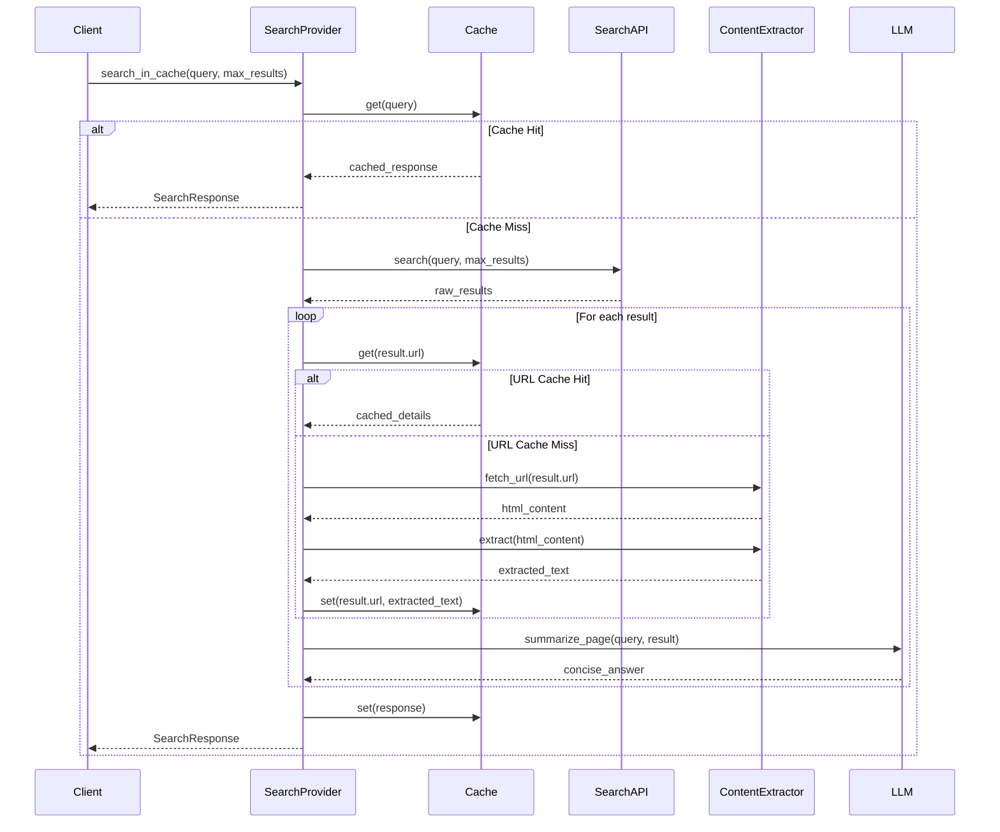
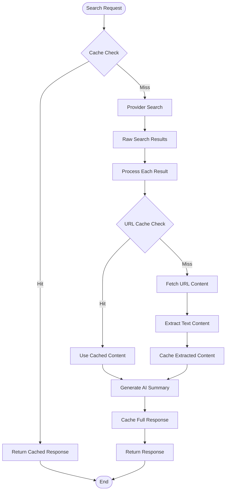

# Search Providers Module Documentation

## Introduction

The search-providers module implements a pluggable architecture for web search functionality across multiple search engines. It provides a unified interface for performing searches, caching results, and generating AI-powered summaries of web content. The module supports DuckDuckGo, SearXNG, and Google Custom Search APIs, with built-in caching mechanisms and content extraction capabilities.

## Architecture Overview

The module follows an abstract factory pattern with a base `SearchProvider` class that defines the contract for all search implementations. Each concrete provider implements the search logic specific to its underlying API while inheriting common functionality like caching and content processing.



## Component Relationships



## Data Flow Architecture



## Core Components

### SearchProvider (Abstract Base Class)

The `SearchProvider` abstract class defines the contract for all search implementations and provides common functionality:

- **Abstract Method**: `search(query, max_num_result)` - Must be implemented by concrete providers
- **Caching Methods**: `search_in_cache()` and `search_without_cache()` provide caching wrappers
- **Content Processing**: `fetch_details_and_generate_consise_answer()` handles URL fetching, content extraction, and AI summarization
- **Timeout Management**: Implements comprehensive timeout handling for all external operations

**Key Features:**
- Multi-level caching (short-term and long-term)
- Asynchronous content fetching with configurable timeouts
- AI-powered content summarization
- Comprehensive error handling and logging

### DuckDuckGoSearchProvider

Implements search using the DuckDuckGo search engine:

- **Library**: Uses the `duckduckgo_search` Python library
- **Features**: Privacy-focused search without API keys
- **Implementation**: Synchronous library wrapped in async executor
- **Rate Limiting**: Built-in through the DDGS library

### SearxngSearchProvider

Implements search using a self-hosted SearXNG instance:

- **Protocol**: HTTP/HTTPS API calls using httpx
- **Features**: Meta-search engine aggregating multiple sources
- **Configuration**: Requires SearXNG host URL
- **Additional**: Supports image search functionality

### GoogleSearchProvider

Implements search using Google Custom Search JSON API:

- **API**: Google Custom Search API v1
- **Authentication**: Requires API key and Search Engine ID
- **Features**: Supports date-based sorting and time restrictions
- **Rate Limiting**: Subject to Google's API quotas

## Process Flow



## Configuration and Dependencies

### External Dependencies
- **trafilatura**: Web content extraction and text processing
- **httpx**: Asynchronous HTTP client for API calls
- **duckduckgo_search**: DuckDuckGo search library
- **asyncio**: Asynchronous programming support

### Configuration Requirements
- **tralifatura_config**: Configuration for content extraction (from [constants](constants.md))
- **Cache Clients**: Short-term and long-term caching (from [clients](clients.md))
- **LLM Client**: For content summarization (from [clients](clients.md))
- **Logger**: For operation logging (from [logs](logs.md))

### Provider-Specific Configuration
- **DuckDuckGo**: No configuration required
- **SearXNG**: Requires host URL parameter
- **Google**: Requires API key and Search Engine ID

## Error Handling and Timeouts

The module implements comprehensive timeout handling:

- **Cache Lookup**: 5-second timeout
- **URL Fetching**: 10-second timeout
- **Content Extraction**: 5-second timeout
- **LLM Summarization**: Configurable timeout (sumup_page_timeout)

All operations are wrapped in try-catch blocks with detailed logging of failures and performance metrics.

## Performance Optimization

- **Multi-level Caching**: Reduces redundant API calls and content fetching
- **Async Processing**: Concurrent processing of multiple search results
- **Timeout Management**: Prevents hanging operations
- **Selective Processing**: Only fetches details for results that will be returned

## Usage Patterns

### Basic Search with Caching
```python
provider = DuckDuckGoSearchProvider()
response = await provider.search_in_cache("query", max_results=10)
```

### Direct Search without Caching
```python
provider = GoogleSearchProvider(api_key, engine_id)
response = await provider.search_without_cache("query", max_results=10)
```

### Custom Provider Implementation
```python
class CustomSearchProvider(SearchProvider):
    async def search(self, query: str, max_num_result: int) -> SearchResponse:
        # Custom search implementation
        pass
```

## Integration Points

The module integrates with:
- **[schemas](schemas.md)**: SearchResponse and SearchResult data structures
- **[clients](clients.md)**: Caching and LLM clients
- **[logs](logs.md)**: Centralized logging system
- **[constants](constants.md)**: Configuration constants

## Security Considerations

- **API Keys**: Google provider requires secure API key management
- **Rate Limiting**: Respects provider-specific rate limits
- **Content Filtering**: Relies on underlying search engines for content safety
- **Timeout Protection**: Prevents resource exhaustion through comprehensive timeouts

## Monitoring and Observability

The module provides detailed logging for:
- Search query execution times
- Cache hit/miss ratios
- Content fetching performance
- LLM summarization times
- Success/failure rates for each operation

All operations include timing information and detailed error messages for debugging and performance monitoring.